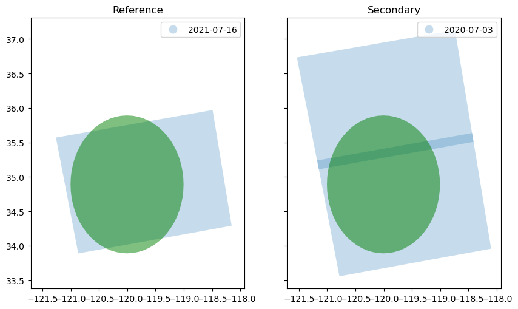

# S1-Enumerator

Uses `asf-search` to enumerate Sentinel-1 A/B pairs for interferograms.



Also provides functions to check if a [`S1-GUNW`](https://asf.alaska.edu/data-sets/derived-data-sets/sentinel-1-interferograms/) exists in the ASF DAAC.

## Install

1. `conda env update -n s1-enumerator --file environment.yml` (or use [`mamba`](https://github.com/mamba-org/mamba) to speed install up)
2. `pip install .`

Requires `asf_search`, `geopandas`, `rasterio`, `requests`, `tqdm`, and `hyp3-sdk`. See the `environment.yml`.

## Usage

See [notebooks](notebooks/) for examples.

```
from s1_enumerator import distill_all_pairs, enumerate_ifgs

# Over Los Padres National Forest, CA
point = Point(-120.0048, 34.8923)
aoi = point.buffer(1)

# Get all data from ASF Search
ifg_pairs_tiles = enumerate_ifgs(aoi,
                                 min_reference_date=datetime.datetime(2021, 7, 9),
                                 enumeration_type='tile',
                                 min_days_backward = 364,
                                 num_neighbors_ref=3,
                                 num_neighbors_sec=1,
                                 temporal_window_days=60,
                                 min_ref_tile_overlap_perc=.2,
                                 min_tile_aoi_overlap_km2=1e3,
                                 minimum_path_intersection_km2=1e3,
                                 minimum_ifg_area_km2=3e4,
                                 entire_s1_catalog=False
                                 )
# Distill for Generating IFGs
df_pairs = distill_all_pairs(ifg_pairs_tiles)
```
